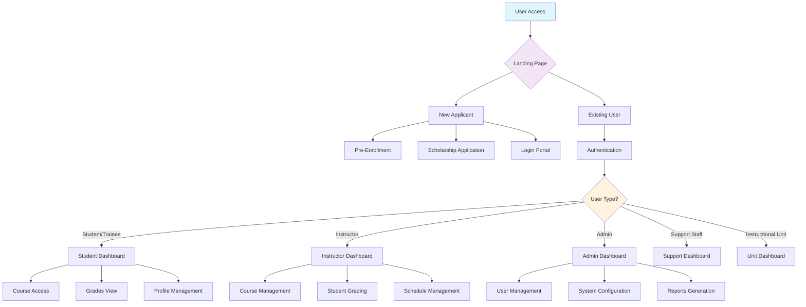
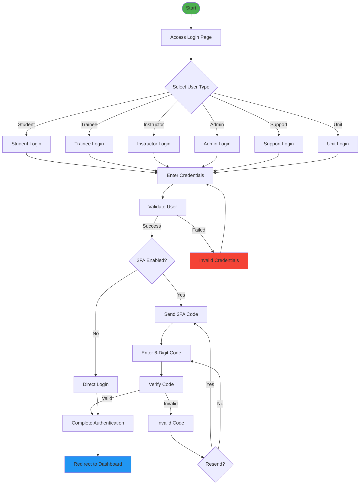
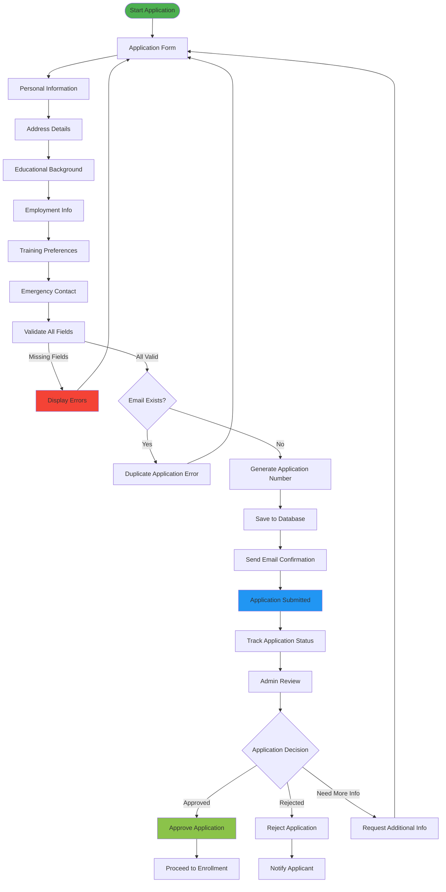
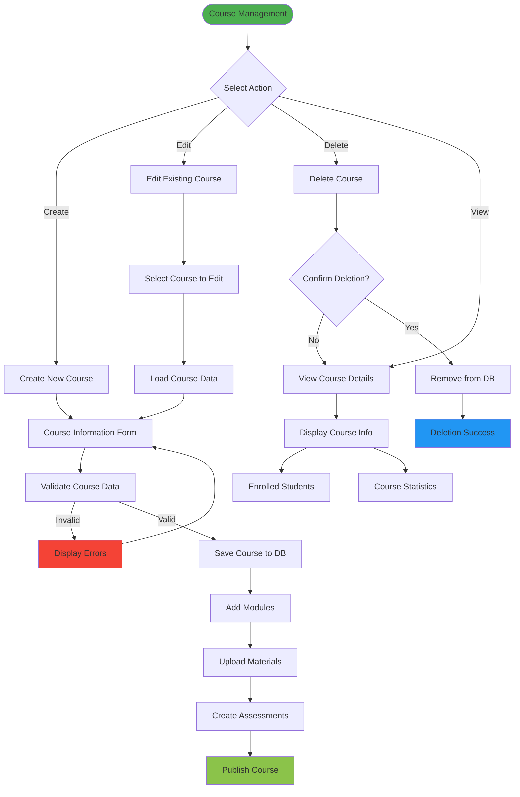
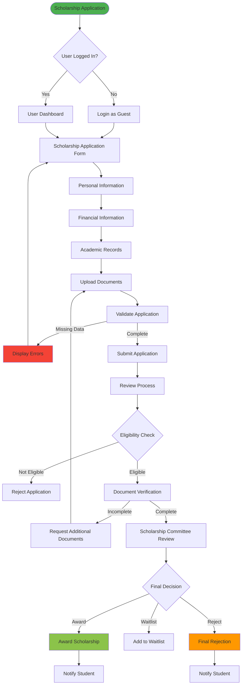
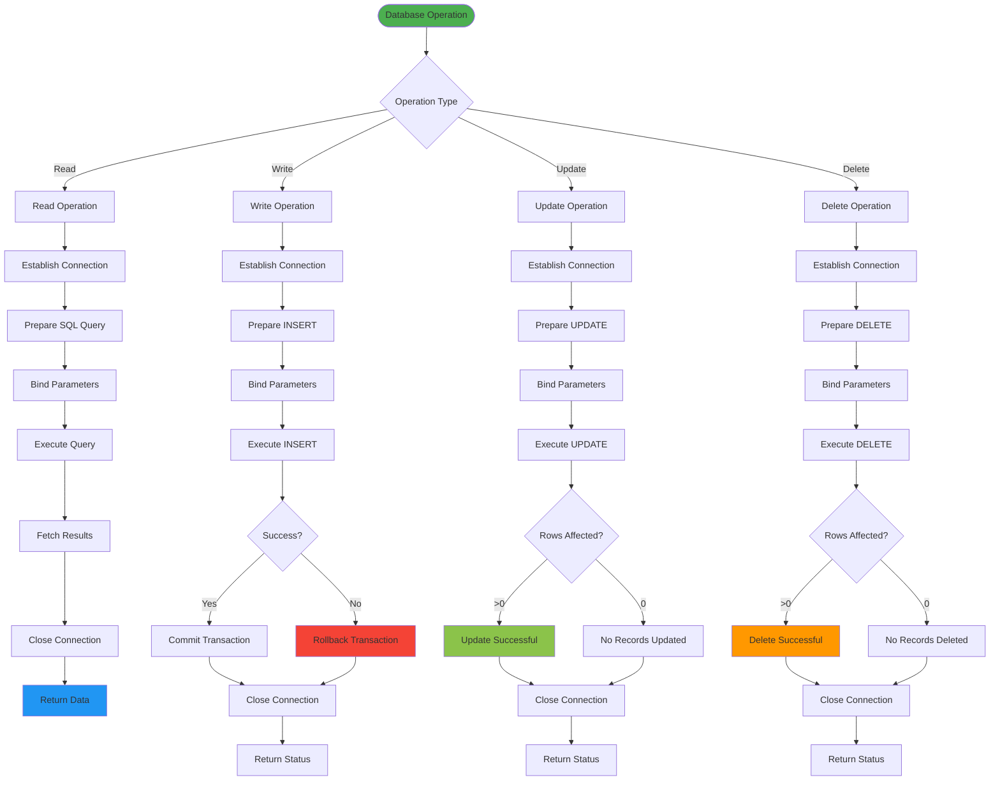

# TESDA Auto Mechanic Training Centre - System Flowcharts

## Table of Contents
1. [Overall System Architecture Flowchart](#overall-system-architecture-flowchart)
2. [User Authentication Flowchart](#user-authentication-flowchart)
3. [Pre-Enrollment Process Flowchart](#pre-enrollment-process-flowchart)
4. [User Dashboard Navigation Flowchart](#user-dashboard-navigation-flowchart)
5. [Course Management Flowchart](#course-management-flowchart)
6. [Scholarship Application Flowchart](#scholarship-application-flowchart)
7. [Database Operations Flowchart](#database-operations-flowchart)

---

## Overall System Architecture Flowchart

---

## User Authentication Flowchart

---

## Pre-Enrollment Process Flowchart

---

## User Dashboard Navigation Flowchart

```mermaid
graph TD
    Login([User Logged In]) --> Dashboard[User Dashboard]
    
    Dashboard --> UserType{User Type}
    
    UserType -->|Student/Trainee| StudentFlow[Student Features]
    UserType -->|Instructor| InstructorFlow[Instructor Features]
    UserType -->|Admin| AdminFlow[Admin Features]
    UserType -->|Support| SupportFlow[Support Features]
    UserType -->|Unit| UnitFlow[Unit Features]
    
    StudentFlow --> Courses[My Courses]
    StudentFlow --> Grades[View Grades]
    StudentFlow --> Materials[Training Materials]
    StudentFlow --> Profile[Profile Management]
    
    InstructorFlow --> CourseMgmt[Course Management]
    InstructorFlow --> StudentMgmt[Student Management]
    InstructorFlow --> Grading[Grade Assessments]
    InstructorFlow --> Schedule[Class Schedule]
    
    AdminFlow --> UserMgmt[User Management]
    AdminFlow --> SystemConfig[System Configuration]
    AdminFlow --> Reports[Reports & Analytics]
    AdminFlow --> Database[Database Management]
    
    SupportFlow --> Applications[Process Applications]
    SupportFlow --> Records[Manage Records]
    SupportFlow --> HelpDesk[Help Desk]
    
    UnitFlow --> Programs[Program Oversight]
    UnitFlow --> Curriculum[Curriculum Management]
    UnitFlow --> Quality[Quality Assurance]
    
    Courses --> CourseDetail[Course Details]
    Grades --> GradeView[Grade Details]
    Materials --> MaterialView[Material Access]
    Profile --> ProfileEdit[Edit Profile]
    
    CourseMgmt --> CourseCreate[Create Course]
    StudentMgmt --> StudentList[Student List]
    Grading --> GradeAssign[Assign Grades]
    Schedule --> ScheduleEdit[Edit Schedule]
    
    style Login fill:#4caf50
    style Dashboard fill:#2196f3
```

---

## Course Management Flowchart

---

## Scholarship Application Flowchart

---

## Database Operations Flowchart

---

## Program Flow Summary

### **Main Entry Points:**
1. **Landing Page** (`index.php`) - System entry point
2. **Login Portal** (`login/index.php`) - Authentication gateway
3. **Pre-Enrollment** (`pre_enrollment.php`) - Application process
4. **Scholarship** (`scholarship_application.php`) - Financial aid

### **User Journey Paths:**
- **New User:** Landing → Pre-Enrollment → Login → Dashboard
- **Existing User:** Landing → Login → Dashboard → Features
- **Admin:** Landing → Login → Admin Dashboard → System Management

### **Key Decision Points:**
- User type selection during login
- Application validation checkpoints
- Authentication with/without 2FA
- Course access permissions
- Scholarship eligibility checks

### **Data Flow:**
1. **Input:** User forms and interactions
2. **Validation:** Server-side validation and sanitization
3. **Processing:** Business logic execution
4. **Storage:** Database operations
5. **Output:** Results and user feedback

---

## Technical Implementation Notes

### **Security Flow:**
- CSRF token generation and validation
- Input sanitization and parameter binding
- Password hashing with PHP's `password_hash()`
- Two-factor authentication implementation
- Session management and timeout

### **Error Handling:**
- Database connection failures
- Form validation errors
- Authentication failures
- File upload errors
- System exception handling

### **Performance Considerations:**
- Database connection pooling
- Query optimization
- Caching strategies
- Resource cleanup
- Transaction management

---

**Last Updated:** April 18, 2026  
**System Version:** 1.0.0  
**Flowchart Version:** 1.0

For technical implementation details, refer to the consolidated source code file: `CRUCIAL_SOURCE_CODE_CONSOLIDATED.php`
